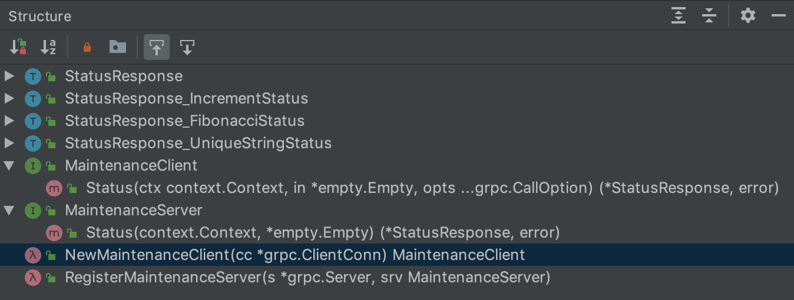
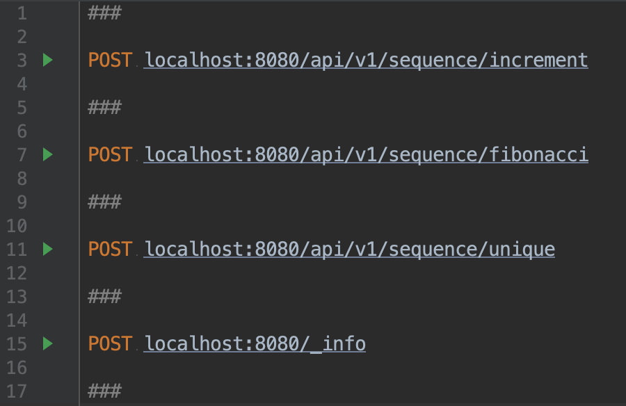
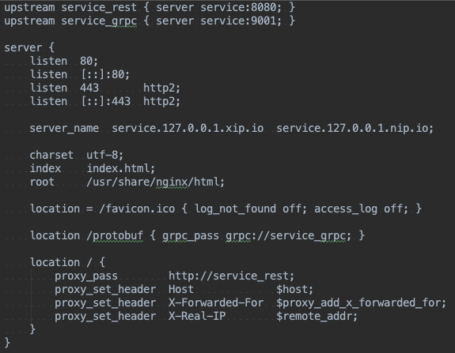

# Постановка задачи

Мы хотим создать сервис, который будет генерировать для нас уникальные значения.
Для начала можно использовать три источника: инкремент, последовательность Фибоначчи и UUID v4.

## Шаг 1. Декларативное описание контракта

```bash
$ make step-1
```

На этом шаге мы опишем публичное API и не забудем о получении служебной информации для поддержки.

## Шаг 2. Подготовительная работа

```bash
$ make step-2
```

На этом шаге мы сгенерируем необходимые DTO и заготовки для сервера.

Зависимости:

- https://github.com/protocolbuffers/protobuf
- https://github.com/golang/protobuf

Проблемы:

- maintenance.proto:9:48: "Status" is not a message type
  - https://github.com/protocolbuffers/protobuf/issues/3377
- protoc-gen-go: program not found or is not executable
  - https://github.com/gogo/protobuf
  - https://github.com/golang/protobuf



## Шаг 3. Запускаем сервер

```bash
$ make step-3
```

На этом шаге мы имплементируем интерфейс сервера, запустим его stub-версию
и вызовем служебный метод Status.

## Шаг 4. Переход к REST

```bash
$ make step-4
```

На этом шаге нам потребуется расширить возможности сервера, предоставив к нему REST интерфейс.


Зависимости:

- https://github.com/grpc-ecosystem/grpc-gateway
- https://github.com/googleapis/googleapis

Проблемы:

- protoc-gen-grpc-gateway: program not found or is not executable
  - https://github.com/grpc-ecosystem/grpc-gateway
- internal/protocol/grpc/gateway/maintenance.pb.gw.go:32:92: undefined: MaintenanceClient
  - импортируем руками



## Шаг 5. Документация

```bash
$ make step-5
```

На этом шаге мы сгенерируем swagger-спецификацию и поднимем с ней контейнер Swagger UI

Зависимости:

- https://github.com/docker/docker-ce
- https://hub.docker.com/editions/community/docker-ce-desktop-mac

Проблемы:

- protoc-gen-swagger: program not found or is not executable
  - https://github.com/grpc-ecosystem/grpc-gateway



## Шаг 6. Генерация клиента на Python

```bash
$ make step-6
```

На этом шаге мы сгенерируем клиент к сервису на другом языке, например, на Python.

Зависимости:

- Python
  - `grpcio-tools             >= 1.19.0`
  - `googleapis-common-protos >= 1.5.9`

## Шаг 7. Avito way

Завершающий этап, на котором будет рассмотрен подход, выбранный в Avito,
со своим собственным форматом Brief и тулингом для кодогенерации DTO и клиентов.

Акценты:

- сервис Рубрикатор, проблемы, с которыми столкнулись
- `avito service dependency add ...`
- `avito service codegen`
